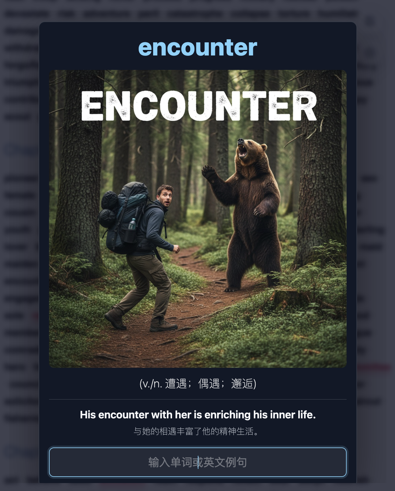
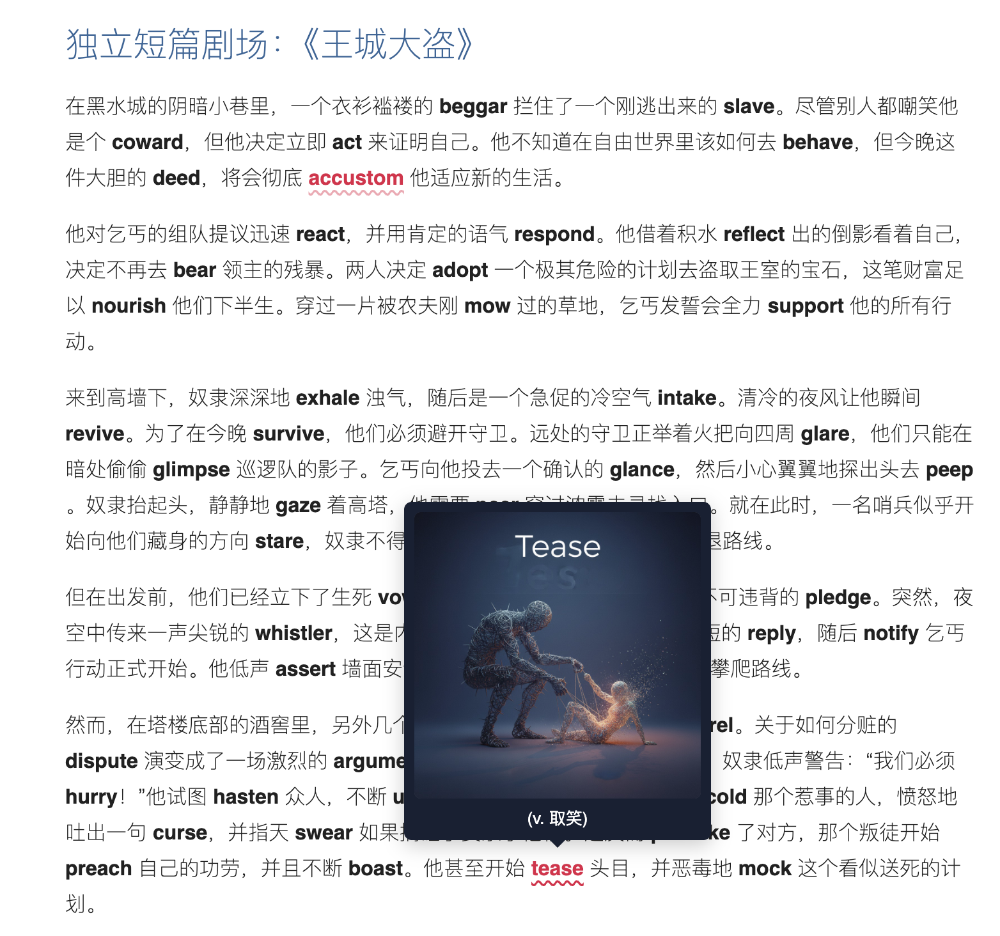

# IELTS-Vacab-Fantasia

<p align="center">
  
</p>

一个把单词变成**可看、可听、可应用**记忆单元的本地 IELTS 词汇学习工具。项目将 `content/` 中新增或变更的 Markdown 增量编译到 `dist/`，并提供翻译气泡、图片记忆卡、TTS、生词本和快捷键切词等交互。

<br>

<p align="center">
  <a href="https://yangdongxing.github.io/IELTS-Vacab-Fantasia/"><strong>快速查看：打开在线版本体验 →</strong></a>
</p>

<br>

## 多维度单词记忆

IELTS-Vacab-Fantasia 不把单词停留在孤立的“英文—中文”对照上。同一个词会同时连接四类线索：

- **视觉记忆**：用具象照片建立画面联想，并在正文气泡和沉浸式覆层中重复呈现。
- **听觉记忆**：可朗读单词、中文词义和英文例句，让发音、含义与使用场景形成连续的声音线索。
- **精选例句**：以简短、自然、日常可用的完整句子呈现真实用法；适合共享时复用同一句，减少不必要的例句负担。
- **故事记忆**：以中文母语叙事承载情节，将英文关键词自然穿插其中，降低理解语境的负担，并在连续故事中记住单词的含义与用法。

复习时还可以通过主动输入单词、例句中的核心短语或完整英文例句进行验证。较长例句会加粗自然、实用且与目标词直接相关的短语，便于先记搭配，再逐步记住整句；短句或没有实际意义短语的例句不会强行标注。视觉负责唤起画面，听觉负责建立语音印象，例句负责呈现实际用法，故事负责串联上下文，主动回忆负责把它们真正连接起来。

<p align="center">
  
  <br>
  <sub>沉浸式覆层：照片联想、词义、精选例句、朗读与主动输入集中在一次复习中。</sub>
</p>

<p align="center">
  
  <br>
  <sub>短篇剧场：单词保留在连续语境中，点击即可调出对应的视觉记忆。</sub>
</p>

## 构建

项目只使用一条构建命令：

```bash
python3 build_site.py build
```

构建完成后直接打开 `dist/index.html`。未变化的 Markdown 会被跳过，新增或修改的内容会生成对应 HTML，删除 Markdown 时也会清理旧 HTML。

## GitHub Pages

`main` 分支中影响站点的文件发生变化后，`.github/workflows/deploy-pages.yml` 会重新构建并发布 `dist/`。站点地址为：

<https://yangdongxing.github.io/IELTS-Vacab-Fantasia/>

首次使用时，需要在仓库的 **Settings > Pages > Build and deployment > Source** 中选择 **GitHub Actions**。也可以在 Actions 页面手动运行 `Deploy GitHub Pages`。

`dist/assets` 在仓库中仍是指向外层 `assets/` 的符号链接；Pages 官方上传 Action 会在打包时解引用该链接，因此线上产物包含完整 CSS、JavaScript 和图片，但仓库中仍只维护一份资源。

## 目录结构

```text
IELTS-Vacab-Fantasia/
├── README.md                     # 项目入口与目录说明
├── build_site.py                 # Markdown 增量构建器
├── content/                      # 需要编译的学习内容
│   ├── index.md                  # 自动汇总全部内容的静态站点首页
│   ├── ielts/
│   │   ├── chapters/             # IELTS 章节串记
│   │   ├── vocabulary-notebooks/ # 生词本与复习材料
│   │   ├── phrase-notebooks/     # 词伙与短语材料
│   │   └── vocabulary-list.md    # 雅思词汇真经总表
│   ├── writing/                  # IELTS 写作词伙
│   └── junior-high/              # 初中英语内容
├── assets/                       # 唯一静态资源库
│   ├── branding/                 # 项目 logo、icon 与 README 截图
│   ├── css/                      # 页面样式
│   ├── js/                       # 页面交互脚本
│   └── images/                   # 单词图片
├── data/                         # CSV 等原始数据
│   ├── spoken-usage.jsonl        # 中英实用例句、来源及可选核心短语
│   ├── guided-replacements.jsonl # 原模板句的人工策展替换
│   └── shared-example-reuse.jsonl # 仅复用已有例句的共享映射
├── tools/                        # 数据生成与校验工具
│   ├── generate_spoken_usage.py  # 生成、保留和检查口语例句
│   ├── curate_guided_usage.py    # 筛选和维护模板句替换
│   └── focus.py                  # 查询和修改例句核心短语
├── docs/                         # 项目维护文档
├── archive/                      # 不参与构建的历史资料
│   ├── legacy-html/              # 旧版 HTML 页面
│   └── notes/                    # 旧笔记与临时材料
└── dist/                         # 自动生成的静态站点
    ├── assets -> ../assets       # 资源目录链接，不复制资源
    ├── index.html
    ├── word-images.js
    └── __word_images__.json
```

## 目录职责

- 需要展示为网页的 Markdown 只放入 `content/`。
- CSS、JavaScript 和图片只保存在 `assets/`，避免重复数据。
- CSV 等生成来源放入 `data/`。
- 项目说明放入 `docs/`，不会被编译成学习页面。
- 旧文件放入 `archive/`，不会进入 `dist/`。
- `dist/` 是构建产物，不手工编辑其中的 HTML 或图片索引。
- `dist/index.html` 会自动列出其余所有学习页面，无需手工维护目录。

## 关键文件

- `assets/branding/project-icon.svg`：融合照片与语音波形的项目 icon。
- `assets/branding/project-logo.svg`：包含完整项目名称的横向 logo。
- `assets/branding/memory-overlay.png`：多维度单词记忆覆层截图。
- `assets/branding/context-image-tip.png`：短篇语境与图片联想气泡截图。
- `assets/css/almond.css`：阅读页面基础样式。
- `assets/js/monkey-for-extensions.js`：翻译、TTS、生词本和快捷键交互。
- `assets/js/word-image-preview.js`：图片气泡与全屏记忆卡。
- `data/雅思词汇真经单词共3674个.csv`：原始词汇数据。
- `data/spoken-usage.jsonl`：图片词条的中英口语例句与可选 `focus` 核心短语；构建时写入 `word-images.js`。
- `data/shared-example-reuse.jsonl`：人工复核后的目标词到已有例句锚点映射；不保存或创造新例句。
- `tools/generate_spoken_usage.py`：口语例句生成器和完整性校验器。
- `tools/focus.py`：安全查询、设置和清除例句的 `focus` 核心短语。

## 核心短语命令

日常维护例句标粗时使用 `tools/focus.py`，不需要直接编辑 JSONL：

```bash
python3 tools/focus.py show faint
python3 tools/focus.py set faint "I'm going to faint"
python3 tools/focus.py set faint "I feel like **I'm going to faint.**"
python3 tools/focus.py clear faint
python3 tools/focus.py validate
```

`set` 和 `clear` 默认会重新构建站点。连续修改多条时可在命令末尾添加 `--no-build`，全部完成后统一运行：

```bash
python3 build_site.py build
```

## 更多说明

- [项目结构](docs/project-structure.md)
- [内容索引](docs/content-index.md)
- [维护说明](docs/maintenance.md)
